# Manual de Usuario — New Transport Quoter

**Version:** 1.0
**Fecha:** 24 de marzo de 2026
**Elaborado por:** Boxting Labs

---

## Tabla de Contenido

1. [Descripcion General](#1-descripcion-general)
2. [Alcance](#2-alcance)
3. [Perfiles de Usuario](#3-perfiles-de-usuario)
4. [Acceso al Sistema](#4-acceso-al-sistema)
5. [Navegacion General](#5-navegacion-general)
6. [Modulo de Cotizacion](#6-modulo-de-cotizacion)
   - 6.1 [Listado de Cotizaciones](#61-listado-de-cotizaciones)
   - 6.2 [Acciones por Cotizacion](#62-acciones-por-cotizacion)
   - 6.3 [Crear Nueva Cotizacion](#63-crear-nueva-cotizacion)
   - 6.4 [Ver Cotizacion](#64-ver-cotizacion)
   - 6.5 [Generar PDF](#65-generar-pdf)
7. [Variables de Cotizacion (Tarifas)](#7-variables-de-cotizacion-tarifas)
   - 7.1 [Funciones Comunes](#71-funciones-comunes)
   - 7.2 [Crear y Editar Tarifa](#72-crear-y-editar-tarifa)
8. [Base de Datos Maestros](#8-base-de-datos-maestros)
   - 8.1 [Catalogos Disponibles](#81-catalogos-disponibles)
   - 8.2 [Funcionalidad](#82-funcionalidad)
9. [Mensajes y Validaciones Frecuentes](#9-mensajes-y-validaciones-frecuentes)
10. [Buenas Practicas Operativas](#10-buenas-practicas-operativas)
11. [Control de Cambios del Documento](#11-control-de-cambios-del-documento)

---

## 1. Descripcion General

New Transport Quoter es una plataforma web diseñada para la creacion, consulta y gestion de cotizaciones de transporte de carga. El sistema centraliza la administracion de tarifas por servicio, catalogo de datos maestros y la generacion de documentos PDF formales para clientes.

El sistema esta orientado a equipos de operaciones y comerciales que requieren generar cotizaciones precisas, controladas y trazables, integrando multiples variables logisticas como navieras, terminales, aduanas y servicios conexos.

---

## 2. Alcance

Este manual cubre los tres modulos principales accesibles desde el menu lateral:

- **Modulo de Cotizacion:** creacion dinamica, consulta, aprobacion y generacion de documentos PDF.
- **Variables de Cotizacion:** administracion de tarifas por tipo de servicio (Derecho de Embarque, Gate Out, Aduanas, Agenciamiento Maritimo, Transporte, Termografos, Filtros, Movilidad Senasa).
- **Base de Datos Maestros:** consulta de catalogos de referencia utilizados en el proceso de cotizacion.

---

## 3. Perfiles de Usuario

| Perfil | Acciones permitidas |
|---|---|
| Operador de Cotizaciones | Crear cotizaciones, generar PDF, consultar estados |
| Administrador de Tarifas | Crear, editar y eliminar tarifas por servicio |
| Usuario Consultor | Consultar cotizaciones y catalogos maestros |

---

## 4. Acceso al Sistema

1. Ingresar a la URL del sistema en el navegador.

   

2. Completar los campos de Usuario y Contrasena.

   

3. Presionar el boton **Login**. El sistema redirigira al menu principal.

   

> **Nota:** Si la sesion expira, el sistema redirige automaticamente al modulo de autenticacion. Consulte la seccion [Mensajes y Validaciones Frecuentes](#9-mensajes-y-validaciones-frecuentes) para mas detalle.

---

## 5. Navegacion General

El sistema cuenta con un panel lateral fijo desde el cual se accede a todos los modulos disponibles.

La pantalla inicial del dashboard muestra el listado de cotizaciones.

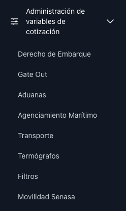

Para cerrar sesion, el usuario autenticado dispone de la opcion en la parte superior del panel lateral.

Al seleccionar **Salir**, el sistema muestra un modal de confirmacion antes de cerrar la sesion.

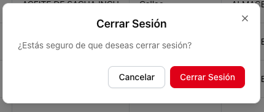

---

## 6. Modulo de Cotizacion

El modulo de Cotizacion es el nucleo del sistema. Permite gestionar el ciclo completo de una cotizacion: desde su creacion hasta la generacion del documento PDF para el cliente.

### 6.1 Listado de Cotizaciones

Desde esta vista se puede filtrar y gestionar el universo de cotizaciones registradas.

**Filtrar por cliente:**

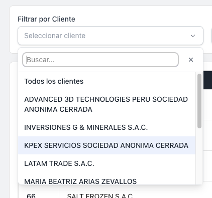

El campo de busqueda permite localizar cualquier cliente disponible en el sistema.

**Filtrar por estado:** los estados disponibles son Generado, Aprobado y Rechazado.

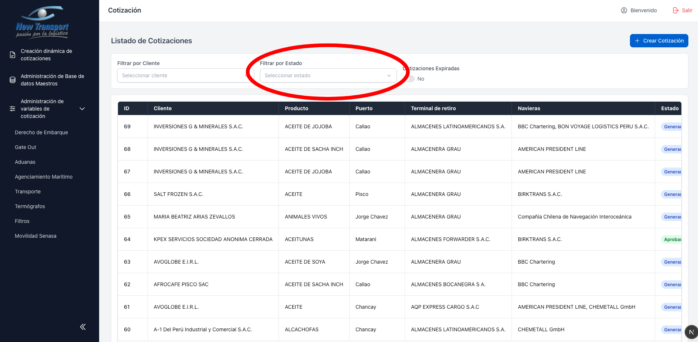

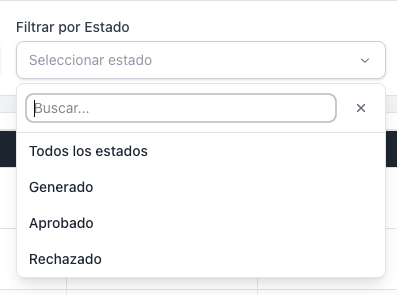

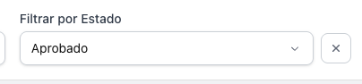

**Filtrar por tarifas expiradas:**

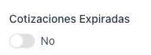

**Limpiar filtros activos:**

**Crear nueva cotizacion:** el boton se encuentra en la parte superior derecha del listado.

---

### 6.2 Acciones por Cotizacion

Cada cotizacion dispone de un menu de acciones accesible desde el icono de tres puntos al final de cada fila.

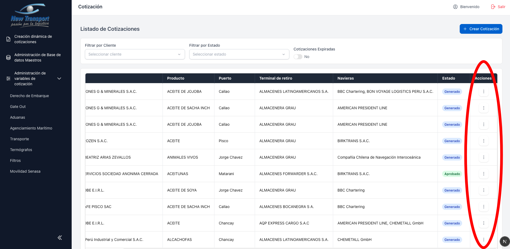

Las acciones disponibles dependen del estado actual de la cotizacion:

- **Generar PDF** y **Ver** — disponibles en todos los estados.

  

- **Aprobar Cotizacion** y **Eliminar** — disponibles solo para estado **Generado**.

  

- **Actualizar Cotizacion** — disponible solo para estado **Aprobado**.

  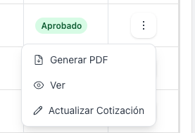

---

### 6.3 Crear Nueva Cotizacion

1. Seleccionar **Crear Cotizacion** desde el [listado](#61-listado-de-cotizaciones).

2. Completar los datos comunes de la cotizacion:
   - Cliente
   - Producto
   - Puerto
   - Es paquetes reefer (Si / No)
   - Canal
   - Tipo de Llenado
   - Servicio
   - Aplica

   

3. Agregar al menos una fila en la tabla de cotizacion.

   

   

4. Completar por fila: Naviera, Modalidad y Terminal de ingreso.

   

   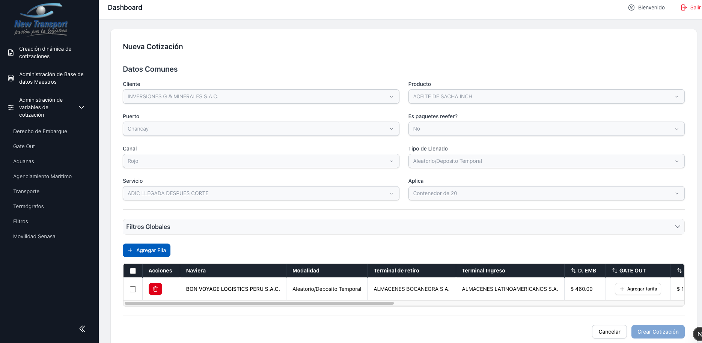

5. Generar las tarifas por servicio. Si el sistema muestra la opcion **Agregar tarifa**, la tarifa debe crearse manualmente desde el modal correspondiente.

   

   

   

6. Opcional: editar los campos de **Adicionales** y **Handling Profit**.

   

   Adicionales:

   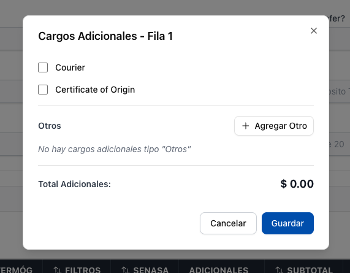

   Handling Profit:

   

   

7. Seleccionar **Crear Cotizacion** para confirmar.

> **Regla importante:** no es posible crear la cotizacion si existen filas incompletas o servicios sin tarifa asignada.

> **Criterio especial de puerto:** para puertos con reglas de negocio particulares (por ejemplo, Pisco), la validacion de Gate Out puede variar. Consulte con el administrador del sistema ante dudas sobre un puerto especifico.

---

### 6.4 Ver Cotizacion

La vista de detalle de una cotizacion muestra la informacion completa del registro:

- Datos de cabecera: Cliente, Producto, Puerto, indicador de Paquetes Reefer y Estado.

  

- Tabla completa de filas con costos por servicio y totales.

  

  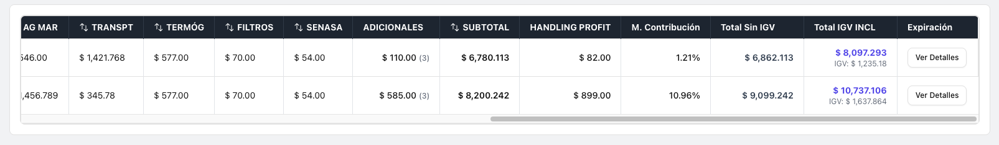

- Acceso directo para [generar el PDF](#65-generar-pdf) de la cotizacion.

  

Vista completa del modulo:

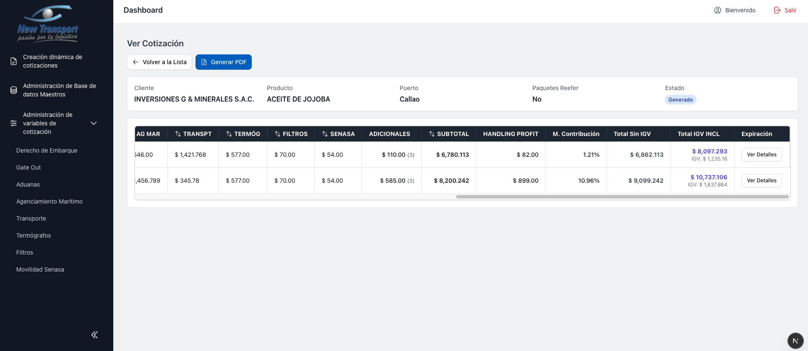

---

### 6.5 Generar PDF

Desde esta pantalla se configuran los parametros del documento antes de descargarlo.

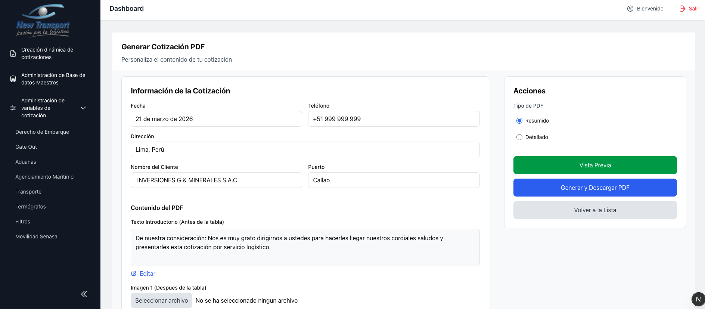

**Opciones disponibles:**

- Editar datos de cabecera: fecha, telefono, direccion, cliente y puerto.

  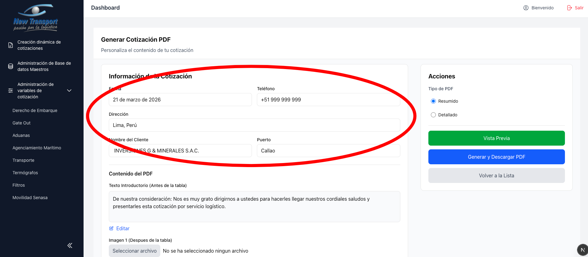

- Editar texto introductorio y texto de cierre del documento.

  

- Adjuntar hasta 3 imagenes en formato JPG o PNG.

  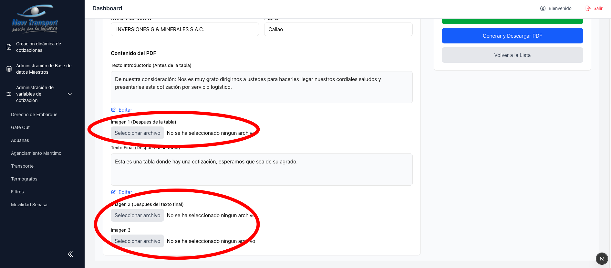

- Seleccionar el tipo de PDF: **Resumido** o **Detallado**.

  

**Vista previa del documento:**

Resumido:

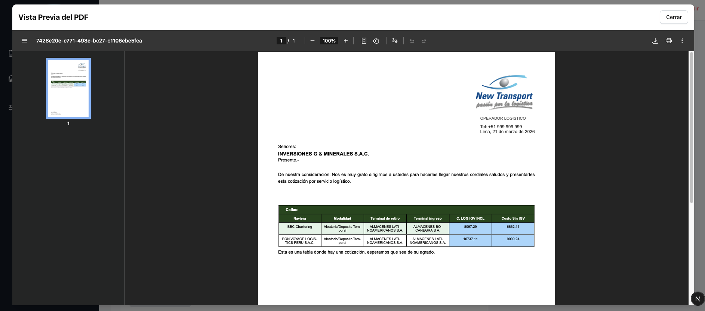

Detallado:

Para descargar el PDF directamente sin visualizar la vista previa, utilizar el boton **Generar y Descargar PDF**.

---

## 7. Variables de Cotizacion (Tarifas)

Este modulo agrupa la administracion de tarifas utilizadas en el proceso de cotizacion. Cada tipo de servicio tiene su propia seccion, pero todas comparten el mismo comportamiento de listado y mantenimiento.

**Servicios disponibles:**

- Derecho de Embarque

  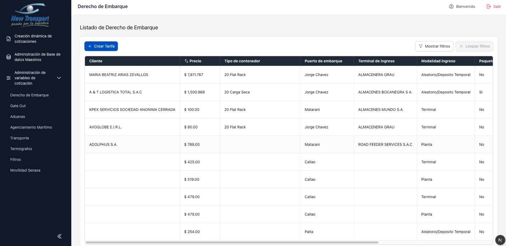

- Gate Out

  

- Aduanas

  

- Agenciamiento Maritimo

  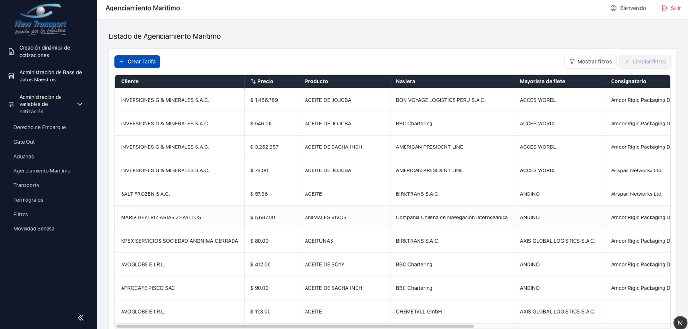

- Transporte

  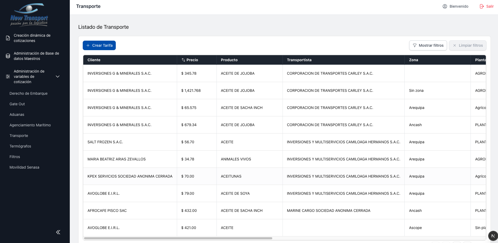

- Termografos

  

- Filtros

  

- Movilidad Senasa

  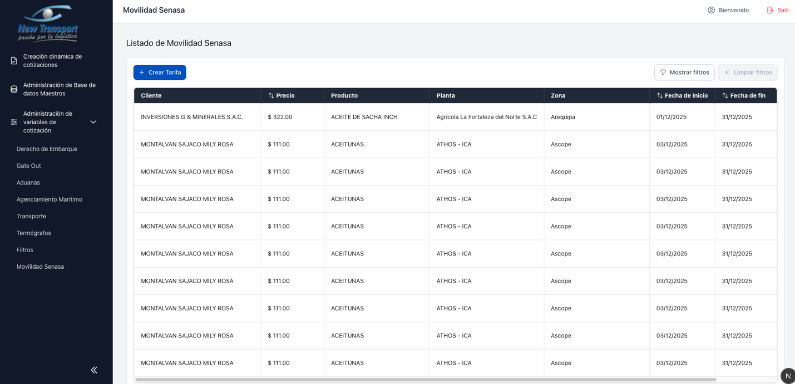

---

### 7.1 Funciones Comunes

Todos los modulos de tarifas comparten las siguientes funcionalidades:

**Listado paginado con ordenamiento por columna:**

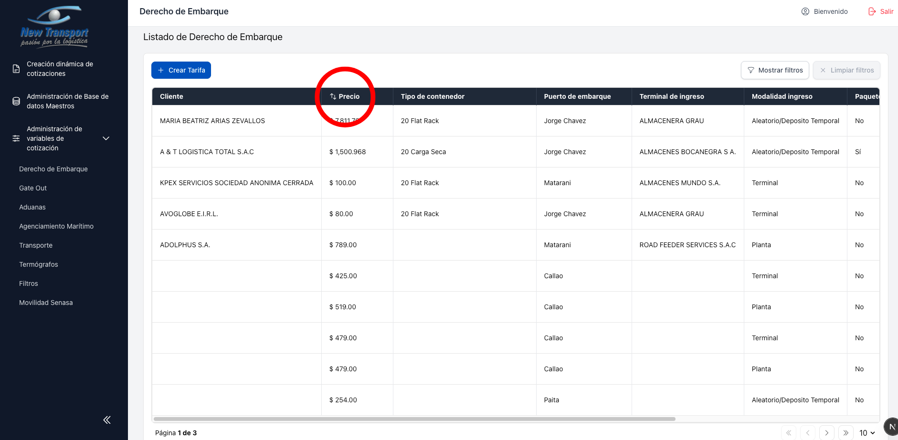

Las columnas que muestran el indicador de ordenamiento permiten organizar los resultados de forma ascendente o descendente.

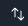

**Mostrar y ocultar filtros de columna:**

**Limpiar filtros:** el boton realiza una limpieza total de todos los filtros activos. Adicionalmente, cada filtro individual cuenta con su propio boton de limpieza.

**Crear tarifa:**

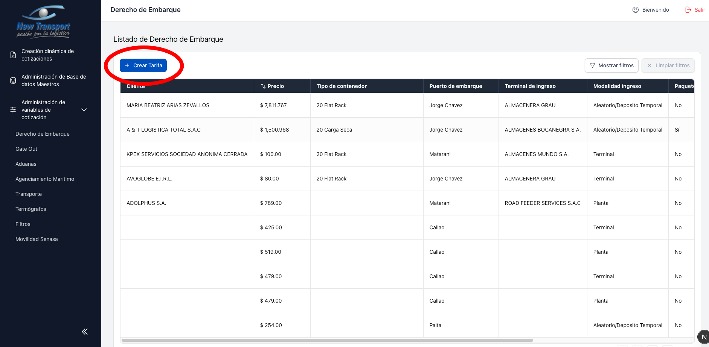

**Editar registro existente:**

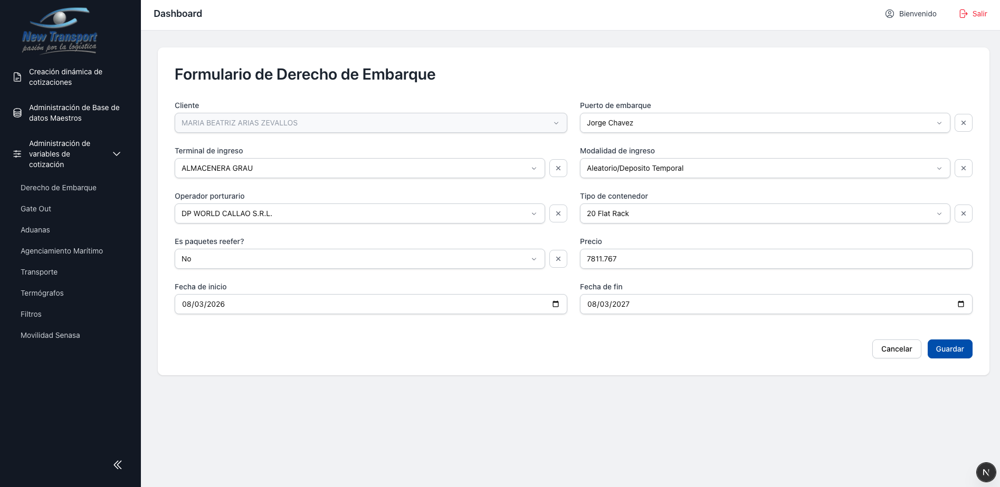

**Eliminar registro** — requiere confirmacion en un modal de confirmacion.

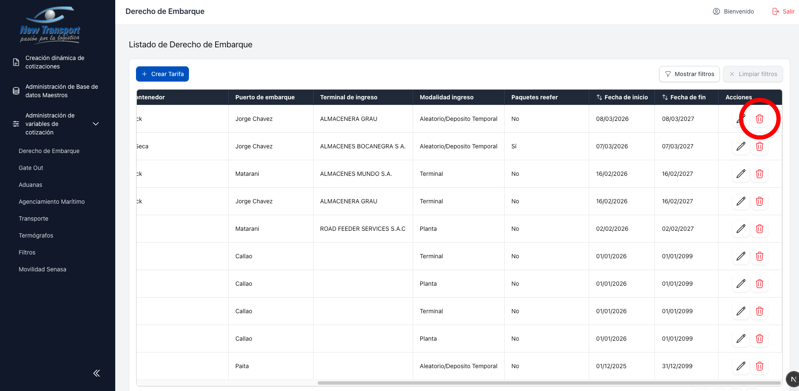

---

### 7.2 Crear y Editar Tarifa

Al registrar una tarifa se solicita la siguiente informacion:

- Variables comerciales y logisticas (cliente, producto, terminales, zona, etc.).
- Precio.
- Vigencia: fecha de inicio y fecha de fin.

El siguiente ejemplo corresponde a la creacion de una tarifa de **Derecho de Embarque**:

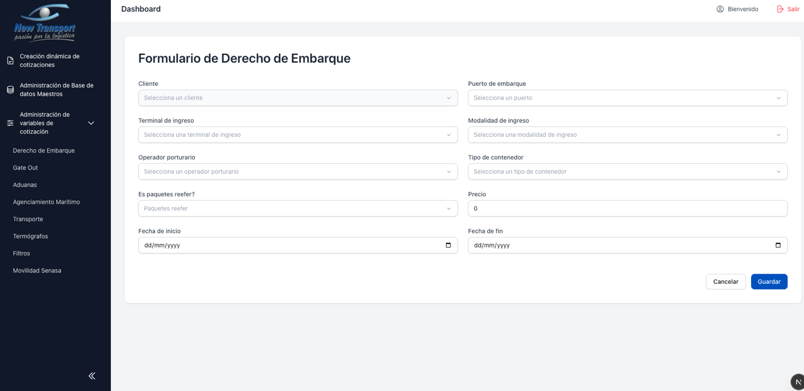

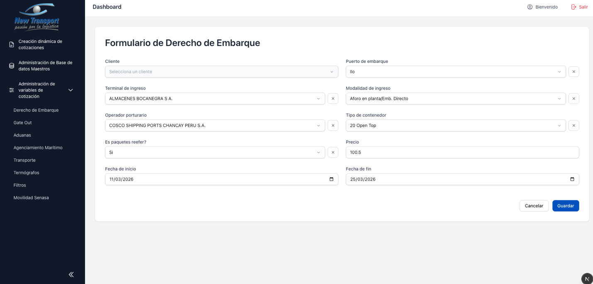

Edicion de tarifa existente:

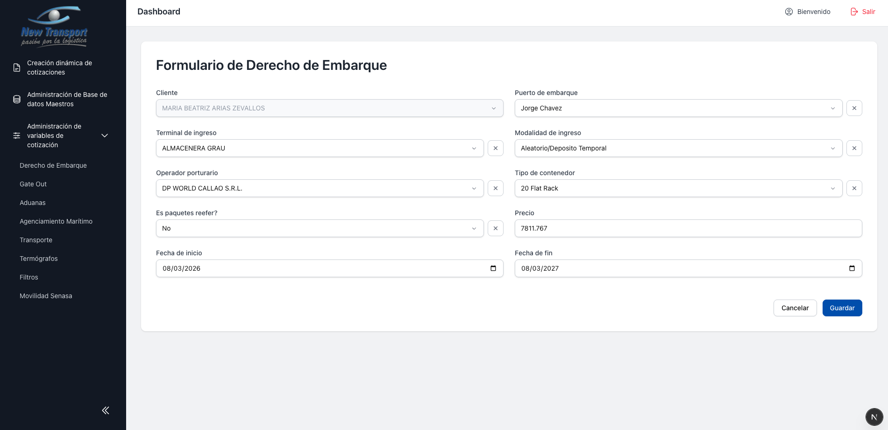

> **Nota:** en el modo de edicion, segun el modulo, algunos campos base pueden estar bloqueados para mantener la consistencia historica de los registros.

---

## 8. Base de Datos Maestros

El modulo de **Administracion de Base de Datos Maestros** permite consultar los catalogos de referencia que se utilizan en el proceso de cotizacion. Al ingresar, el sistema presenta por defecto el catalogo de **Puertos de Embarque**.

### 8.1 Catalogos Disponibles

| Catalogo |
|---|
| Puertos de embarque |
| Terminales de ingreso |
| Terminales de retiro |
| Terminales de retorno |
| Modalidades de ingreso |
| Clientes |
| Consignatarios |
| Mayoristas |
| Agentes de Aduana |
| Jurisdicciones de aduana |
| Transportistas |
| Navieras |
| Puertos |
| Tipos de contenedor |
| Plantas |
| Zonas |
| Termografos |
| Filtros |
| Paquetes refrigerados |

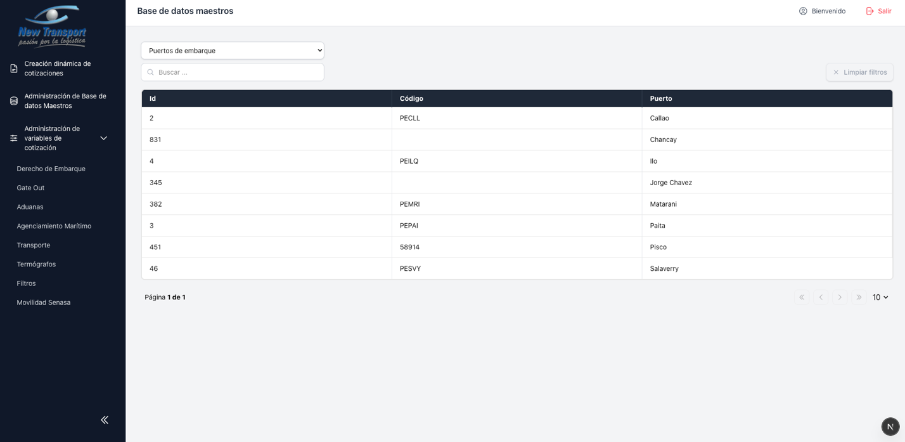

### 8.2 Funcionalidad

**Seleccionar catalogo:** mediante el selector en la parte superior de la pantalla.

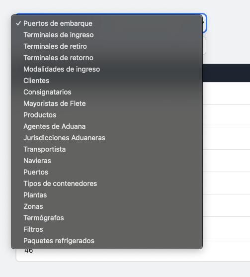

**Buscar por texto:** mediante la barra de busqueda disponible en cada catalogo.

**Navegar por paginas:** el catalogo presenta los resultados paginados.

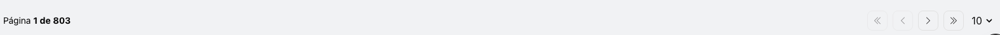

> **Nota:** los catalogos maestros son de solo lectura desde este modulo. La administracion de los datos de referencia se realiza desde el backend del sistema.

---

## 9. Mensajes y Validaciones Frecuentes

| Mensaje o situacion | Causa probable | Accion recomendada |
|---|---|---|
| No permite crear cotizacion | Filas incompletas o servicios sin tarifa | Revisar que todas las filas tengan Naviera, Modalidad, Terminal y tarifa en cada servicio. Ver [Crear Nueva Cotizacion](#63-crear-nueva-cotizacion) |
| Error al cargar datos | Problemas de conectividad o sesion | Verificar conexion a internet, sesion activa y permisos del usuario |
| Redireccion al login | Sesion expirada o tokens invalidos | Iniciar sesion nuevamente. Ver [Acceso al Sistema](#4-acceso-al-sistema) |
| Error al generar PDF | Imagenes con formato o tamano incorrecto | Reintentar y verificar que las imagenes sean JPG o PNG. Ver [Generar PDF](#65-generar-pdf) |

---

## 10. Buenas Practicas Operativas

1. Actualizar periodicamente las tarifas antes de iniciar un proceso de cotizacion. Ver [Variables de Cotizacion](#7-variables-de-cotizacion-tarifas).
2. Utilizar los filtros disponibles para reducir errores en la seleccion de datos. Ver [Listado de Cotizaciones](#61-listado-de-cotizaciones).
3. Verificar las vigencias de las tarifas antes de aprobar una cotizacion.
4. Utilizar la vista previa del PDF antes de descargar el documento final. Ver [Generar PDF](#65-generar-pdf).
5. Mantener la informacion de los catalogos maestros actualizada para garantizar la precision de las cotizaciones. Ver [Base de Datos Maestros](#8-base-de-datos-maestros).

---

## 11. Control de Cambios del Documento

| Version | Fecha | Descripcion | Responsable |
|---|---|---|---|
| 1.0 | 24/03/2026 | Primera version del manual de usuario | Boxting Labs |
