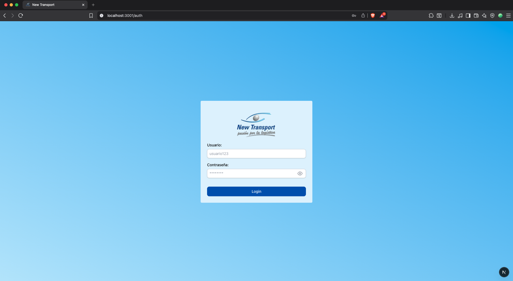
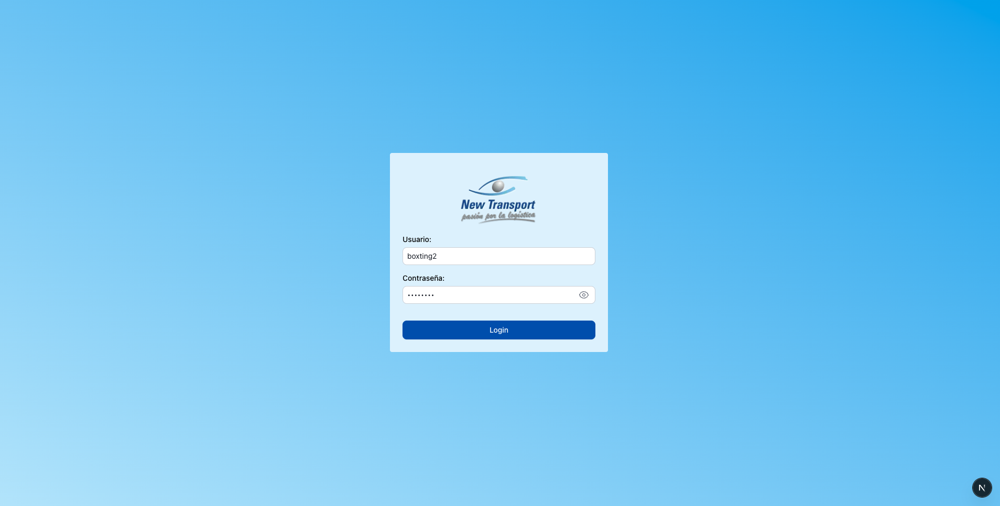
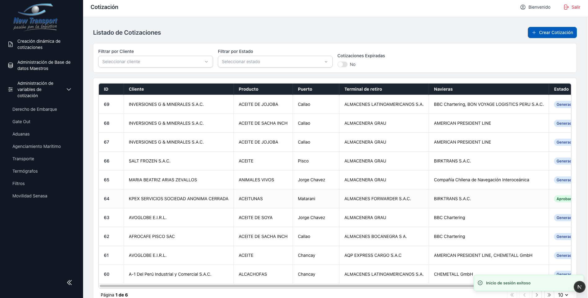

# Acceso al Sistema

1. Ingresar a la URL del sistema en el navegador.

   

2. Completar los campos de Usuario y Contrasena.

   

3. Presionar el boton **Login**. El sistema redirigira al menu principal.

   

!!! note
    Si la sesion expira, el sistema redirige automaticamente al modulo de autenticacion. Consulte la seccion [Mensajes y Validaciones](validaciones.md) para mas detalle.
