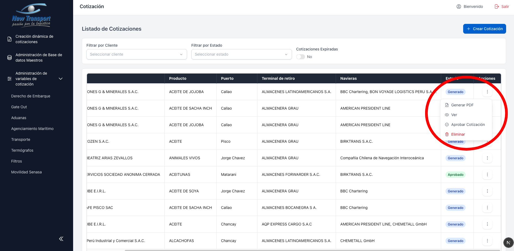
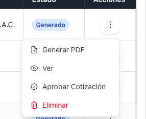

# Acciones por Cotizacion

Cada cotizacion dispone de un menu de acciones accesible desde el icono de tres puntos al final de cada fila.

Las acciones disponibles dependen del estado actual de la cotizacion:

- **Generar PDF** y **Ver** — disponibles en todos los estados.

  

- **Aprobar Cotizacion** y **Eliminar** — disponibles solo para estado **Generado**.

  

- **Actualizar Cotizacion** — disponible solo para estado **Aprobado**.

  
