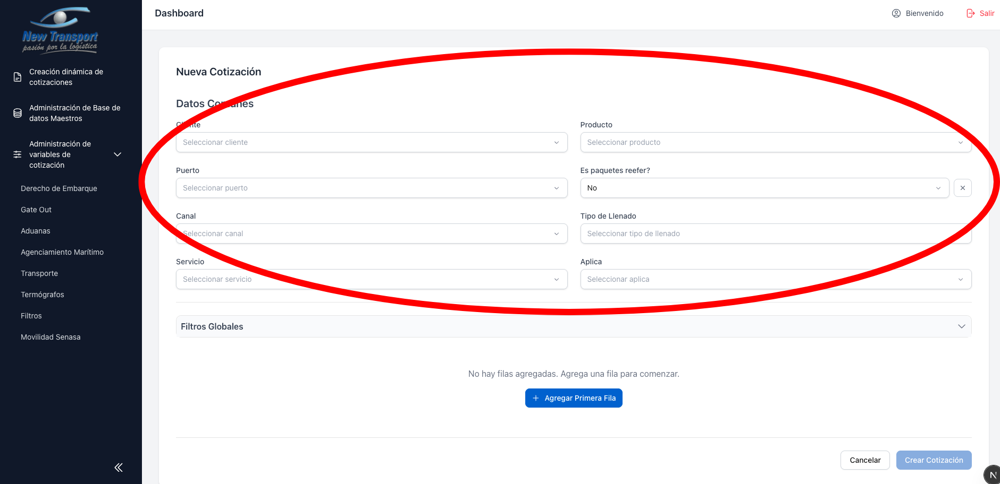
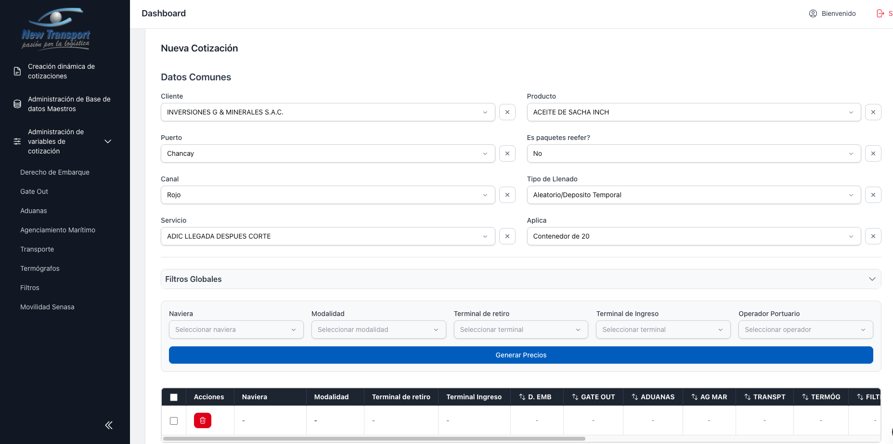
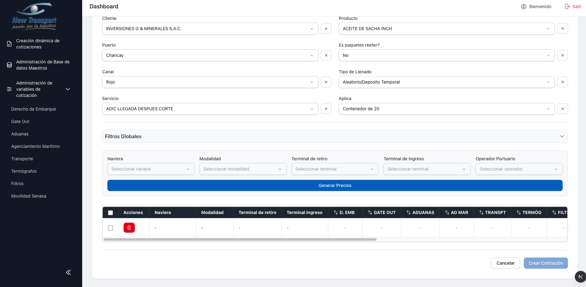
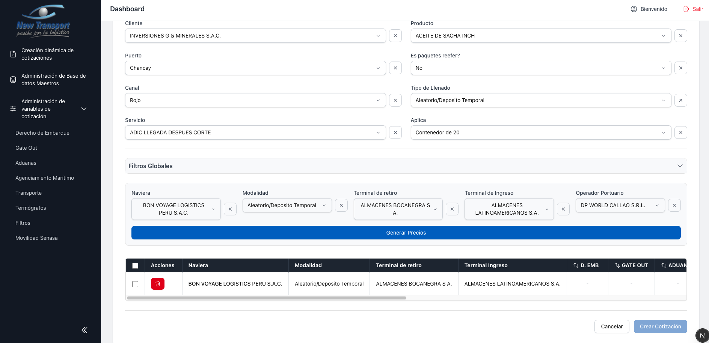
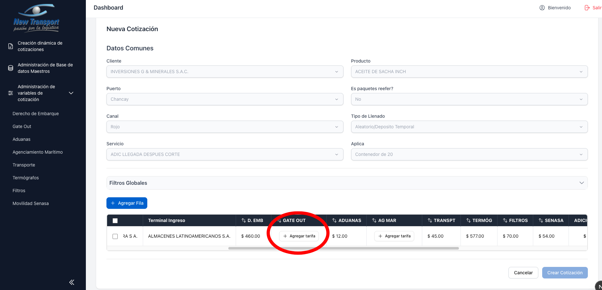
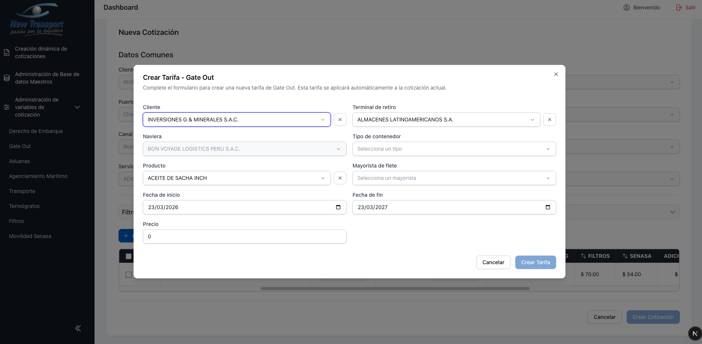
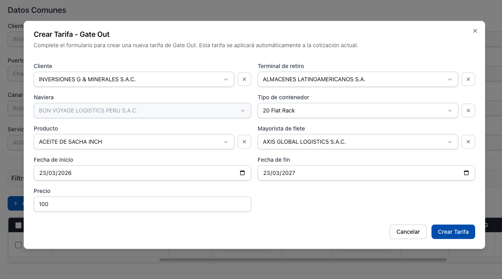
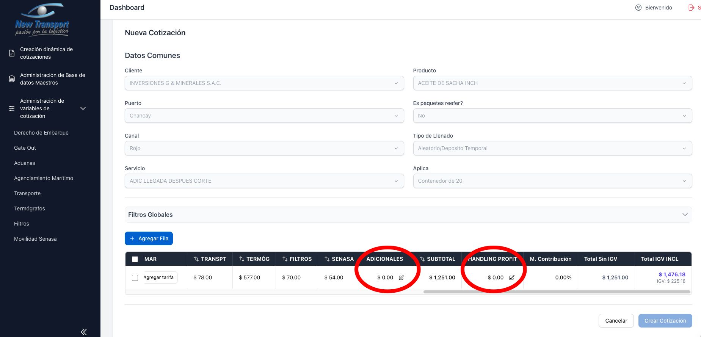
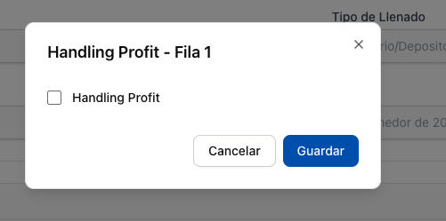
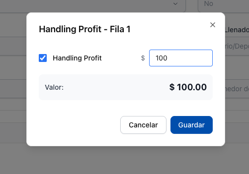

# Crear Nueva Cotizacion

1. Seleccionar **Crear Cotizacion** desde el [listado](listado.md).

2. Completar los datos comunes de la cotizacion:
    - Cliente
    - Producto
    - Puerto
    - Es paquetes reefer (Si / No)
    - Canal
    - Tipo de Llenado
    - Servicio
    - Aplica

   

3. Agregar al menos una fila en la tabla de cotizacion.

   

   

4. Completar por fila: Naviera, Modalidad y Terminal de ingreso.

   

   

5. Generar las tarifas por servicio. Si el sistema muestra la opcion **Agregar tarifa**, la tarifa debe crearse manualmente desde el modal correspondiente.

   

   

   

6. Opcional: editar los campos de **Adicionales** y **Handling Profit**.

   

   Adicionales:

   

   Handling Profit:

   

   

7. Seleccionar **Crear Cotizacion** para confirmar.

!!! warning "Regla importante"
    No es posible crear la cotizacion si existen filas incompletas o servicios sin tarifa asignada.

!!! info "Criterio especial de puerto"
    Para puertos con reglas de negocio particulares (por ejemplo, Pisco), la validacion de Gate Out puede variar. Consulte con el administrador del sistema ante dudas sobre un puerto especifico.
