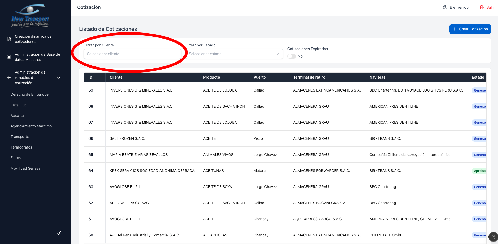
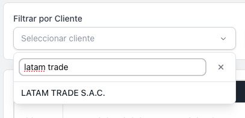
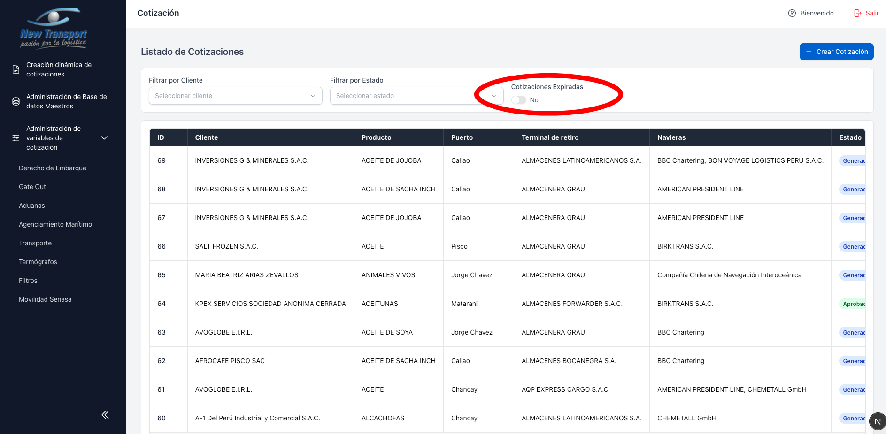
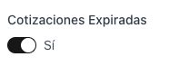
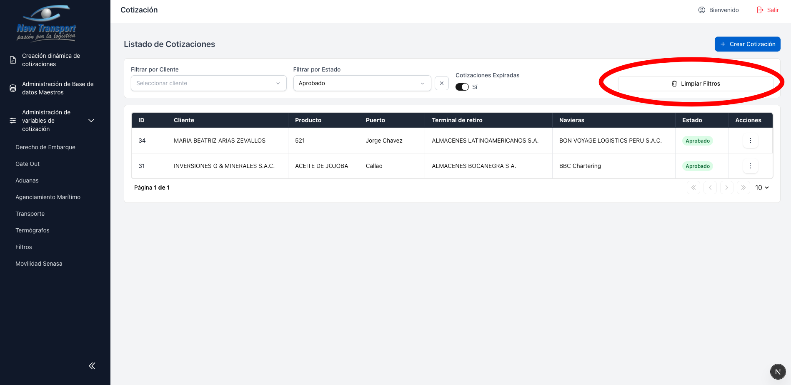
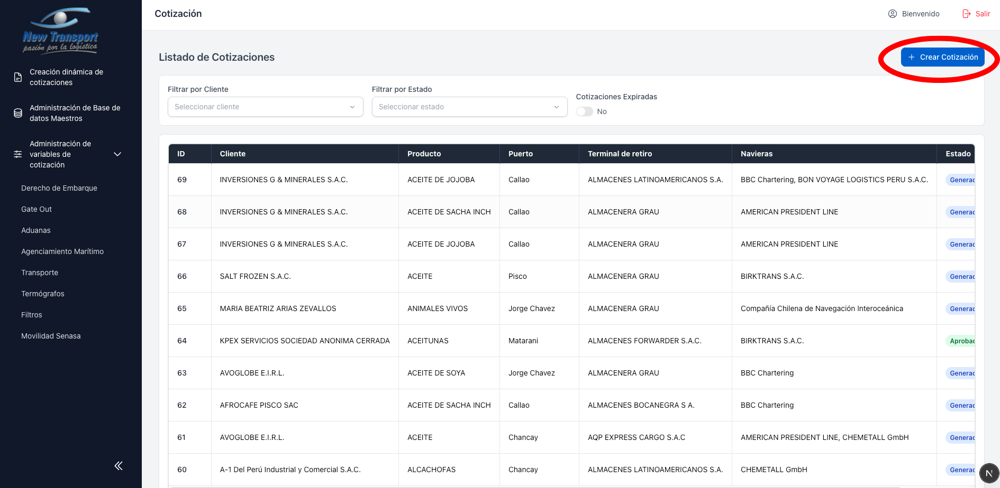

# Listado de Cotizaciones

Desde esta vista se puede filtrar y gestionar el universo de cotizaciones registradas.

## Filtrar por cliente

El campo de busqueda permite localizar cualquier cliente disponible en el sistema.

## Filtrar por estado

Los estados disponibles son **Generado**, **Aprobado** y **Rechazado**.

## Filtrar por tarifas expiradas

## Limpiar filtros activos

## Crear nueva cotizacion

El boton se encuentra en la parte superior derecha del listado.

