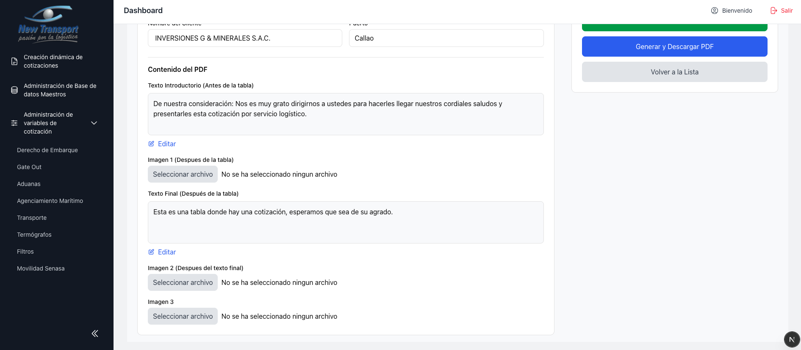
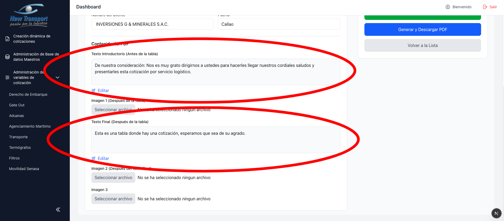
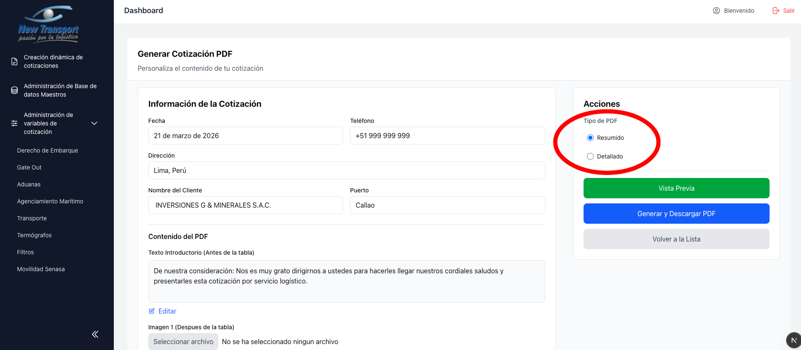
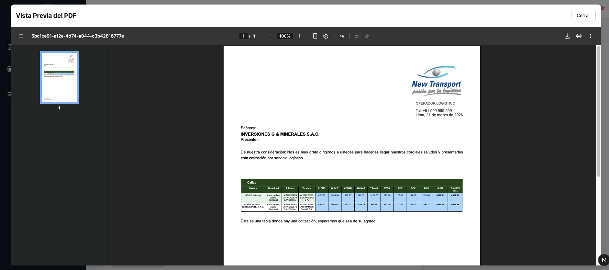
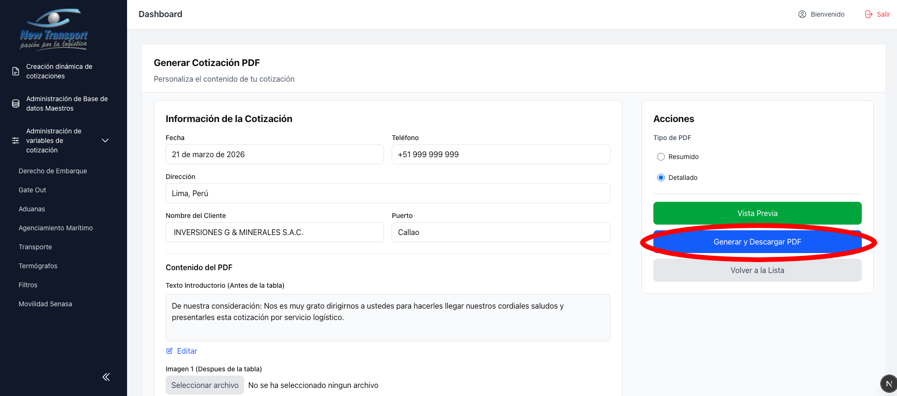

# Generar PDF

Desde esta pantalla se configuran los parametros del documento antes de descargarlo.

## Opciones disponibles

- Editar datos de cabecera: fecha, telefono, direccion, cliente y puerto.

  

- Editar texto introductorio y texto de cierre del documento.

  

- Adjuntar hasta 3 imagenes en formato JPG o PNG.

  

- Seleccionar el tipo de PDF: **Resumido** o **Detallado**.

  

## Vista previa del documento

**Resumido:**

**Detallado:**

Para descargar el PDF directamente sin visualizar la vista previa, utilizar el boton **Generar y Descargar PDF**.

