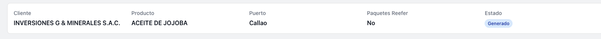
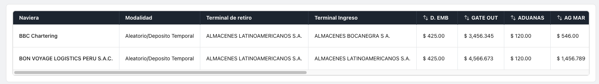
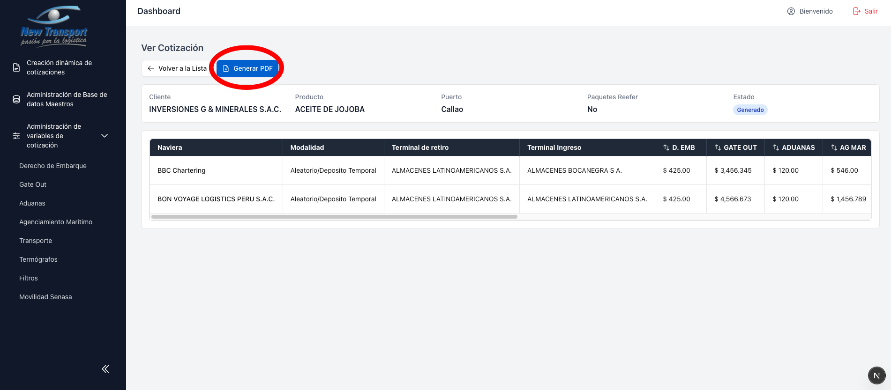

# Ver Cotizacion

La vista de detalle de una cotizacion muestra la informacion completa del registro:

- Datos de cabecera: Cliente, Producto, Puerto, indicador de Paquetes Reefer y Estado.

  

- Tabla completa de filas con costos por servicio y totales.

  

  

- Acceso directo para [generar el PDF](pdf.md) de la cotizacion.

  

Vista completa del modulo:

