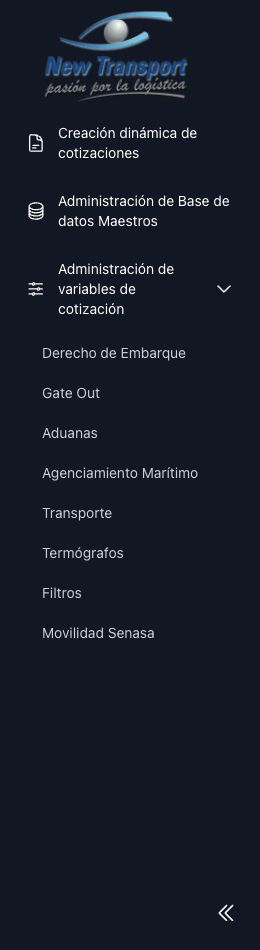
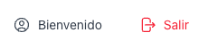

# Navegacion General

El sistema cuenta con un panel lateral fijo desde el cual se accede a todos los modulos disponibles.

La pantalla inicial del dashboard muestra el listado de cotizaciones.

Para cerrar sesion, el usuario autenticado dispone de la opcion en la parte superior del panel lateral.

Al seleccionar **Salir**, el sistema muestra un modal de confirmacion antes de cerrar la sesion.

