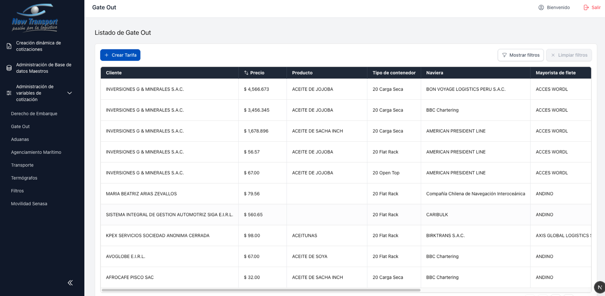
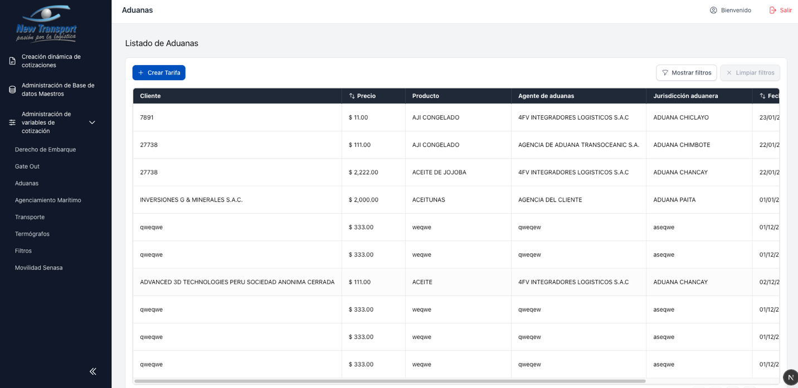
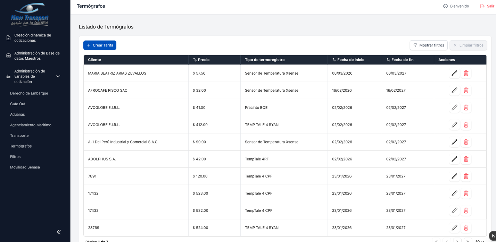
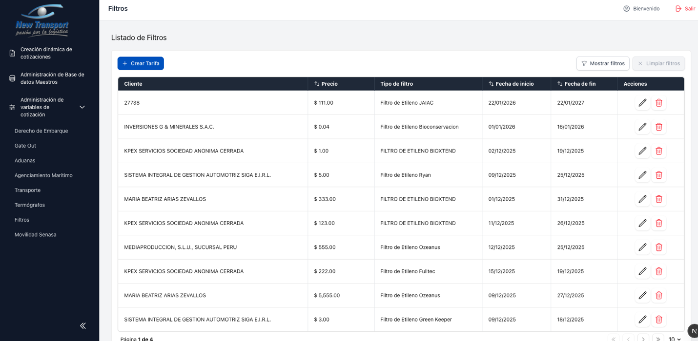
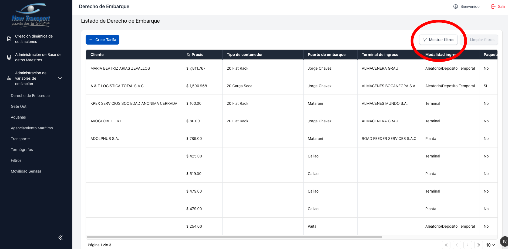
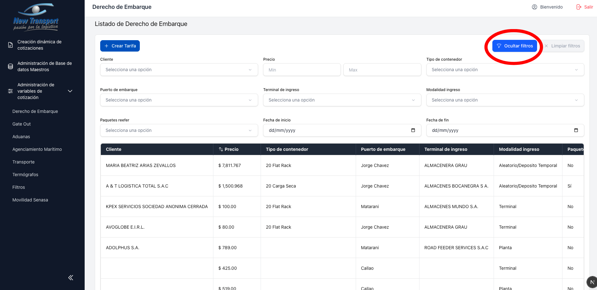
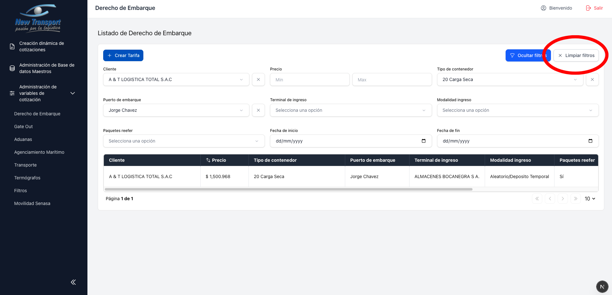
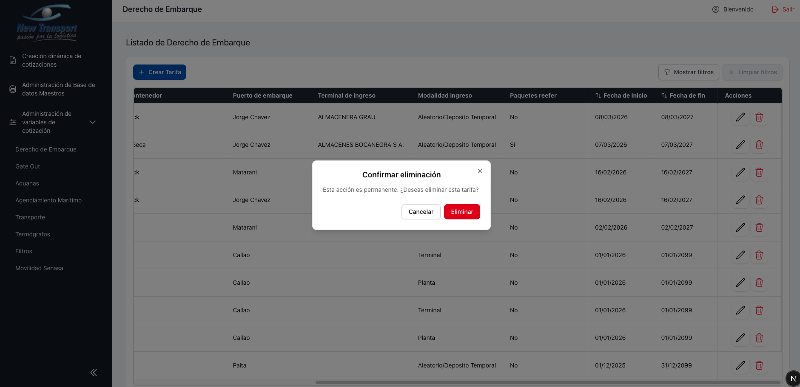

# Variables de Cotizacion (Tarifas)

Este modulo agrupa la administracion de tarifas utilizadas en el proceso de cotizacion. Cada tipo de servicio tiene su propia seccion, pero todas comparten el mismo comportamiento de listado y mantenimiento.

## Servicios disponibles

| Servicio | Imagen de referencia |
|---|---|
| Derecho de Embarque |  |
| Gate Out |  |
| Aduanas |  |
| Agenciamiento Maritimo |  |
| Transporte |  |
| Termografos |  |
| Filtros |  |
| Movilidad Senasa |  |

---

## Funciones Comunes

Todos los modulos de tarifas comparten las siguientes funcionalidades:

### Listado paginado con ordenamiento por columna

Las columnas que muestran el indicador de ordenamiento permiten organizar los resultados de forma ascendente o descendente.

### Mostrar y ocultar filtros de columna

### Limpiar filtros

El boton realiza una limpieza total de todos los filtros activos. Adicionalmente, cada filtro individual cuenta con su propio boton de limpieza.

### Crear tarifa

### Editar registro existente

### Eliminar registro

Requiere confirmacion en un modal de confirmacion.

